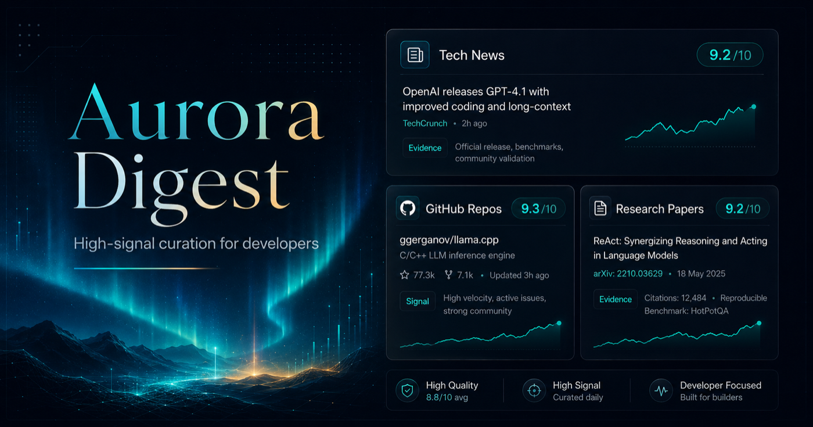
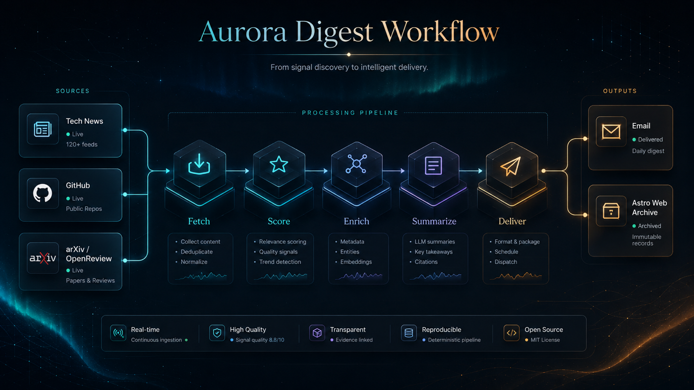
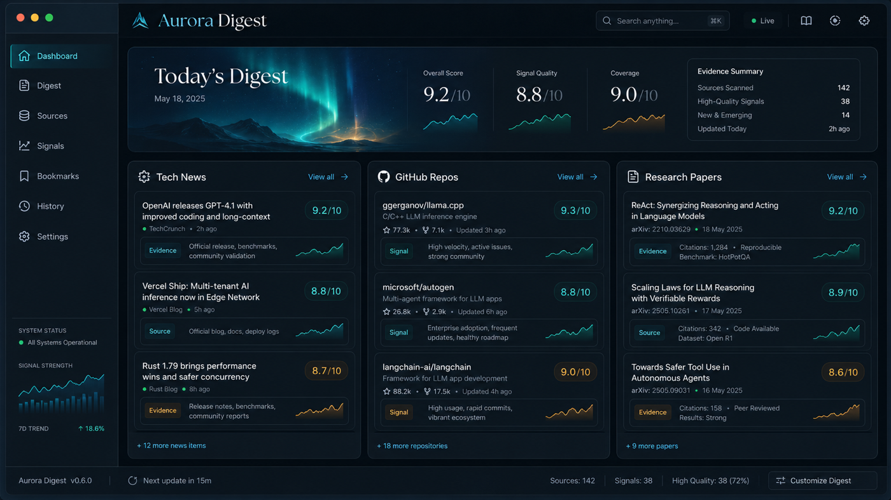

<div align="center">


# Aurora Digest

**A self-hosted, high-signal daily learning radar for AI builders, researchers, and students.**

Aurora turns timely tech news, GitHub repositories, and research papers into a
clean daily digest for email and GitHub Pages, so builders can spend less time
scanning feeds and more time learning what is worth acting on.

[](#)
[](pyproject.toml)
[](https://github.com/astral-sh/uv)
[](.github/workflows/aurora-digest.yml)
[](https://kenny2077.github.io/Aurora/)
[](LICENSE)

<br>



</div>

## Why Aurora

Aurora is a daily learning radar for AI builders, researchers, and students.
It is built for the daily question that broad feeds do not answer well: what is
worth reading, studying, and experimenting with today?

Aurora focuses on a small, high-signal set of useful items:

| Signal | What Aurora looks for | What the digest gives you |
| --- | --- | --- |
| Tech News | Timely AI and technology stories with strong source signals | Linked headline, source, and concise summary |
| GitHub Repos | Projects with real activity, adoption, and learning value | Repo link, score, stats, topic/language chips, and value |
| Research Papers | Papers selected by research fields and enrichment signals | Paper link, venue/status, summary, and what to learn |

The default unified digest stays intentionally compact: 5 tech news items, 3
GitHub repositories, and 3 research papers. Aurora favors a high-signal daily
brief over complete coverage.

## Today's Learning Workflow

The unified digest is designed around a compact daily loop:

- Pick one paper to understand.
- Pick one repo to study.
- Scan timely AI news with high engagement.
- Use the value notes to decide what deserves deeper follow-up.

Aurora tracks:

- `tech_news`: timely, high-engagement technology news.
- `scholar`: research papers by selected research fields.
- `repo_learning`: GitHub repositories by selected learning interests.
- `unified_digest`: one combined digest across news, repos, and papers.

## How It Works

<p align="center">
  
</p>

Aurora keeps one shared pipeline shape across modes:

```text
fetch -> normalize -> deduplicate -> score -> enrich -> summarize -> render -> deliver
```

Each source adapter normalizes into a shared item model, then mode-specific
scoring and enrichment decide which items are worth showing. The visible unified
digest is ordered as:

1. Tech News
2. GitHub Repos
3. Research Papers

Diagnostics stay in CLI output, GitHub Actions logs, and `run_summary.json`;
the email and Pages output stay focused on the digest itself.

## Product Surface

<p align="center">
  
</p>

Aurora publishes the same product-quality digest through practical self-hosted
channels:

- Email delivery through SMTP when recipients are configured.
- GitHub Pages publishing from the generated Astro site.
- Local Markdown and HTML reports for debugging and review.
- JSONL snapshots plus `run_summary.json` for source failures, rate limits, and
  delivery diagnostics.

The screenshot shows the intended digest surface. Aurora is not a hosted SaaS
dashboard; it is a repository you run locally or on GitHub Actions.

## 10-Minute Setup

Local setup:

```bash
rtk uv sync --dev
npm --prefix web ci
rtk uv run aurora config validate --config data/config.example.json
rtk uv run aurora doctor --config data/config.example.json
```

Run a no-network smoke test:

```bash
rtk uv run aurora run --dry-run --mode all --output-dir /tmp/aurora-dry-run
```

Run the unified daily digest locally:

```bash
rtk uv run aurora run --mode unified_digest --config data/config.example.json
```

Run a topic-focused digest using the GitHub Actions config:

```bash
rtk uv run aurora run --mode unified_digest --config data/actions.config.json --topic agents_harness
```

GitHub Actions setup:

1. Fork or clone the repository.
2. Configure GitHub Pages to publish from the `gh-pages` branch.
3. Add only the secrets for channels you enable.
4. Run the `aurora-digest` workflow manually once before relying on the schedule.

## Repository Recommendations

Agents-focused repositories:

```bash
rtk uv run aurora run --mode repo_learning --repo-interest agents
```

Computer-vision repositories:

```bash
rtk uv run aurora run --mode repo_learning --repo-interest cv
```

MCP ecosystem repositories:

```bash
rtk uv run aurora run --mode repo_learning --repo-interest mcp
```

Aurora uses `GH_SEARCH_TOKEN` first, then `GITHUB_TOKEN`, and can run
unauthenticated with lower GitHub rate limits.

## Scholar Radar

Machine-learning research:

```bash
rtk uv run aurora run --mode scholar --research-field ml
```

ML plus agents:

```bash
rtk uv run aurora run --mode scholar --research-field ml --research-field agents
```

## Topic Presets

For the unified digest, `--topic` applies one preset to both repository and
research selection:

| Topic | Repo interest | Scholar field |
| --- | --- | --- |
| `machine_learning` | `ml` | `ml` |
| `agents_harness` | `agents` | `agents` |
| `computer_vision` | `cv` | `cv` |

Use topic presets when you want the daily digest to stay coherent across hands-on
repositories and papers. See [docs/interests.md](docs/interests.md) for the full
interest and research field preset list.

## Secrets

Required only when email delivery is enabled:

- `SMTP_USERNAME, EMAIL_PASSWORD, AURORA_EMAIL_RECIPIENTS`

Optional:

- `DEEPSEEK_API_KEY` for LLM summaries and ranking.
- `GH_SEARCH_TOKEN` for higher GitHub Search API limits.
- `GITHUB_TOKEN fallback` is used automatically in GitHub Actions.
- `SEMANTIC_SCHOLAR_API_KEY` for optional scholar enrichment configuration.

## Delivery

By default Aurora writes Markdown/HTML reports to `reports/` and Astro content
posts to `web/src/content/posts/`. GitHub Actions builds the Astro site into
`web/dist/` for Pages publishing.

Use deterministic-only mode:

```bash
rtk uv run aurora run --mode unified_digest --skip-llm
```

Preview without delivery:

```bash
rtk uv run aurora run --mode unified_digest --skip-delivery
```

Build the Aurora Digest web frontend:

```bash
npm --prefix web run build
```

Run the web frontend locally:

```bash
npm --prefix web run dev -- --host 127.0.0.1 --port 4321
```

## GitHub Pages Setup

Aurora publishes an Astro static site to the `gh-pages` branch. In GitHub
repository settings, configure Pages to deploy from `gh-pages` at the branch
root. The workflow restores prior generated digest content from
`.aurora/content/posts`, writes the latest digest into `web/src/content/posts/`,
builds `web/dist/`, then pushes that generated site to `gh-pages`.

The web UI is built from the AstroPaper-based app in `web/`. The homepage
features the latest digest as "Today's Digest" and groups earlier generated
posts by month. Individual digest pages keep repo cards compact with score
badges, stats, topic/language chips, and a single Value section.

Useful local checks:

```bash
rtk uv run aurora doctor --config data/actions.config.json
rtk uv run aurora run --dry-run --mode all --output-dir /tmp/aurora-actions-smoke
npm --prefix web run build
```

Every run writes JSONL snapshots and a `run_summary.json` file under
`data/runs/<run_id>/<mode>/`. Use that file first when debugging missing
content, source failures, rate limits, or delivery issues.

## Troubleshooting Empty Sections

- Empty research papers usually means arXiv/OpenReview returned no qualifying
  papers or rate-limited; check `scholar_source_failures` and the scholar cache
  note in the unified digest.
- Empty repo learning usually means GitHub Search rate limits, strict star/date
  filters, or repeated recommendations suppressed by state.
- Empty tech news usually means Hacker News/RSS candidates did not meet score,
  recency, or keyword filters.
- Empty Pages output should fail the workflow instead of publishing a placeholder.
  Inspect `run_summary.json`, workflow logs, and `web/src/content/posts/`.

## What Aurora Is Not

Aurora is not a realtime alerting system, an exhaustive literature review, a
SaaS dashboard, or a GitHub Trending clone. It is a self-hosted daily learning
radar that favors a small set of useful items over complete coverage.

## Project Governance

- [Code of Conduct](CODE_OF_CONDUCT.md) defines community standards.
- [Contributing](CONTRIBUTING.md) covers setup, tests, code style, and pull
  request expectations.
- [Security](SECURITY.md) explains supported versions, security properties, and
  vulnerability reporting.

## License

Aurora is released under the [MIT License](LICENSE). See [NOTICE](NOTICE) for
upstream Horizon-family attribution.
